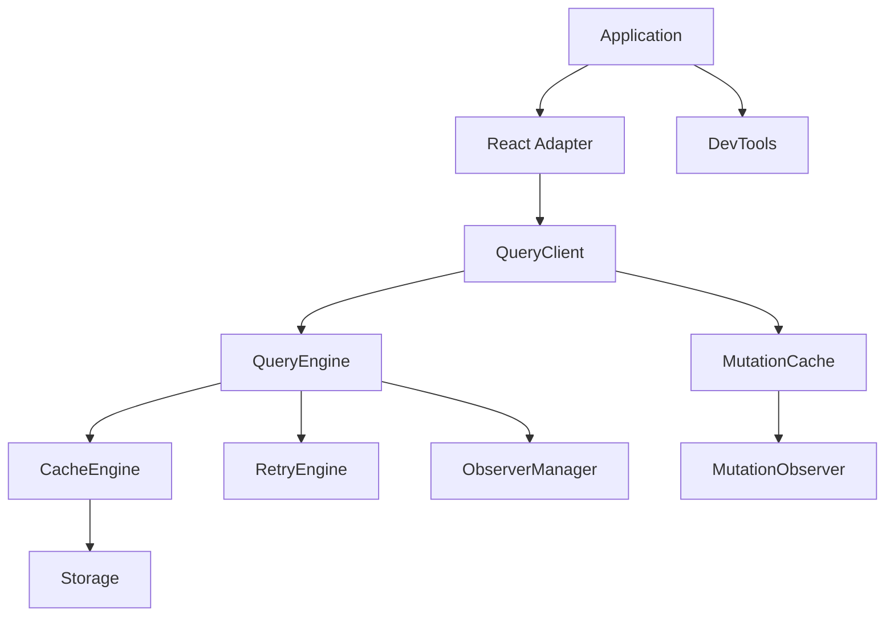

<div align="center">


# SoulCache

A high-performance runtime for data fetching and caching

[](https://github.com/kasihagustinusT/soulcache/actions/workflows/ci.yml)
[](https://github.com/kasihagustinusT/soulcache/actions/workflows/release.yml)
[](https://www.npmjs.com/package/@soulcache/core)
[](https://opensource.org/licenses/MIT)
[](https://www.typescriptlang.org/)
[](https://soulcache.vercel.app)

[Documentation](https://soulcache.vercel.app) | [npm](https://www.npmjs.com/package/@soulcache/core) | [Issues](https://github.com/kasihagustinusT/soulcache/issues)

</div>

SoulCache is a framework-agnostic TypeScript runtime for data fetching and caching. It provides request deduplication, background refetching, retry logic, cache invalidation, and SSR hydration with zero runtime dependencies.

## Why SoulCache

SoulCache is built for applications that fetch data from multiple sources and need a unified caching layer without coupling to a specific UI framework.

- You are using React, Next.js, Vue, Svelte, or vanilla JavaScript
- You need shared caching logic across client and server
- You want predictable cache invalidation without boilerplate
- You need DevTools for debugging cache behavior in development

## Key Features

| Feature | Description |
|---------|-------------|
| **Framework-agnostic runtime** | Works with any UI framework or vanilla JavaScript |
| **Zero runtime dependencies** | Tree-shakeable packages with no external dependencies |
| **TypeScript-first API** | Strict mode with full type inference |
| **Query caching** | Stale-while-revalidate, configurable TTL, automatic eviction |
| **Request deduplication** | Concurrent requests for the same key share a single network call |
| **Mutations** | Optimistic updates with rollback and automatic cache invalidation |
| **Infinite queries** | Cursor-based pagination with page deduplication |
| **SSR & hydration** | Server-side prefetching with dehydrate/hydrate support |
| **Storage adapters** | Pluggable Memory, IndexedDB, and LocalStorage adapters |
| **Plugin system** | Lifecycle hooks for query, mutation, and cache events |
| **React bindings** | Hooks built on `useSyncExternalStore` for React 18+ |
| **DevTools** | Real-time inspection panel with timeline and performance metrics |

## Architecture



## Installation

```bash
# npm
npm install @soulcache/core

# pnpm
pnpm add @soulcache/core

# yarn
yarn add @soulcache/core

# bun
bun add @soulcache/core
```

For React applications:

```bash
npm install @soulcache/react @soulcache/core
```

## Quick Start

```typescript
import { QueryClient } from '@soulcache/core';

const client = new QueryClient();

// Fetch data
const users = await client.fetchQuery({
  queryKey: ['users'],
  queryFn: () => fetch('/api/users').then((r) => r.json()),
});

// Subscribe to updates
const unsubscribe = client.subscribe(['users'], (snapshot) => {
  console.log(snapshot.data, snapshot.status);
});

// Update cache
client.setQueryData(['users'], (prev) => [...prev, newUser]);

// Invalidate and refetch
await client.invalidateQueries(['users']);

// Cleanup
client.destroy();
```

## React Example

```tsx
import { SoulCacheProvider, useQuery } from '@soulcache/react';
import { QueryClient } from '@soulcache/core';

const queryClient = new QueryClient();

function App() {
  return (
    <SoulCacheProvider client={queryClient}>
      <UserList />
    </SoulCacheProvider>
  );
}

function UserList() {
  const { data, status, error } = useQuery({
    queryKey: ['users'],
    queryFn: () => fetch('/api/users').then((r) => r.json()),
  });

  if (status === 'loading') return <p>Loading...</p>;
  if (status === 'error') return <p>Error: {error.message}</p>;

  return (
    <ul>
      {data.map((user) => (
        <li key={user.id}>{user.name}</li>
      ))}
    </ul>
  );
}
```

## Package Overview

| Package | Purpose | Status |
|---------|---------|--------|
| [`@soulcache/core`](./packages/core) | Core runtime with cache, query engine, retry, scheduler, storage, and plugin system | Stable |
| [`@soulcache/react`](./packages/react) | React bindings via `useSyncExternalStore` | Stable |
| [`@soulcache/devtools-core`](./packages/devtools-core) | Framework-agnostic inspection and diagnostics | Stable |
| [`@soulcache/devtools`](./packages/devtools) | React DevTools panel with timeline, metrics, and session recording | Stable |

## Documentation

| Topic | Description |
|-------|-------------|
| [Installation](https://soulcache.vercel.app/docs/installation) | Setup and configuration guide |
| [Quick Start](https://soulcache.vercel.app/docs/quick-start) | Getting started in 5 minutes |
| [API Reference](https://soulcache.vercel.app/docs/query-client) | Complete API documentation |
| [React Adapter](https://soulcache.vercel.app/docs/react-adapter) | React hooks and components |
| [Storage](https://soulcache.vercel.app/docs/storage) | Persistence adapters and configuration |
| [Plugins](https://soulcache.vercel.app/docs/plugins) | Lifecycle hooks and custom extensions |
| [Hydration](https://soulcache.vercel.app/docs/hydration) | SSR and streaming support |
| [Migration Guide](https://soulcache.vercel.app/docs/migration-guide) | Upgrading between versions |
| [Performance](https://soulcache.vercel.app/docs/performance) | Benchmarks and optimization |
| [Troubleshooting](https://soulcache.vercel.app/docs/troubleshooting) | Common issues and solutions |

## Project Status

- Production-ready
- MIT License
- Semantic Versioning
- GitHub Actions CI/CD
- TypeScript strict mode
- Actively maintained

## Contributing

Contributions are welcome. Please read [CONTRIBUTING.md](CONTRIBUTING.md) for the development workflow, code style, and pull request guidelines.

## Support

- [GitHub Issues](https://github.com/kasihagustinusT/soulcache/issues) — Bug reports and feature requests
- [Security Policy](https://github.com/kasihagustinusT/soulcache/blob/main/SECURITY.md) — Vulnerability reporting
- [Documentation](https://soulcache.vercel.app) — Complete documentation

## License

[MIT](LICENSE) — Copyright (c) 2026 Kasih Agustinus
